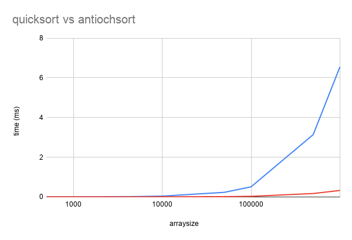

<strong>Immediate disclaimer: I am not the first person to have this idea!</strong>

I made this algorithm on my own, but afterwards I did some research and found a couple of references to the exact same process that people call "bitmap sorting". Its quite an obscure algorithm due to how limited the usecase is, but when it is useful it is devastatingly powerful. I also wondered if possibly this algorithm is so canonical and obvious that maybe thats why theres only a few mentions of it on the internet?

This algorithm uses an array where the size of each array element is encoded not as a number object, but as the array inside an enormours boolean "bit list" array. Its very simple, so the code should be self-explanatory, but for example:
The list [0,2,4,8] is represented as: [1,0,1,0,1,0,0,0,1]

This algorithm only works if:
  - Unsorted array contains only integers greater than or equal to 0
  - Unsorted array has no repeats
In addition, the algorithm peforms better the closer max(array) is to len(array). A tiny 2-long array of [0,e10] will take longer to sort than an enormous [1,2,3,...,10e8] one will.

I made this algorithm because this situation perfectly applies to the random array generator my "Visualiser" program uses (generates a shuffled list of integers 1 to N), but outside of that its really not useful. Jon Bentley mentions this algorithm being used to store phone numbers in his book "Programming Pearls", but aside from that no applications come to mind.

Below is a graph comparing its performance to quicksort for various array sizes (x-axis is logarithmic):

